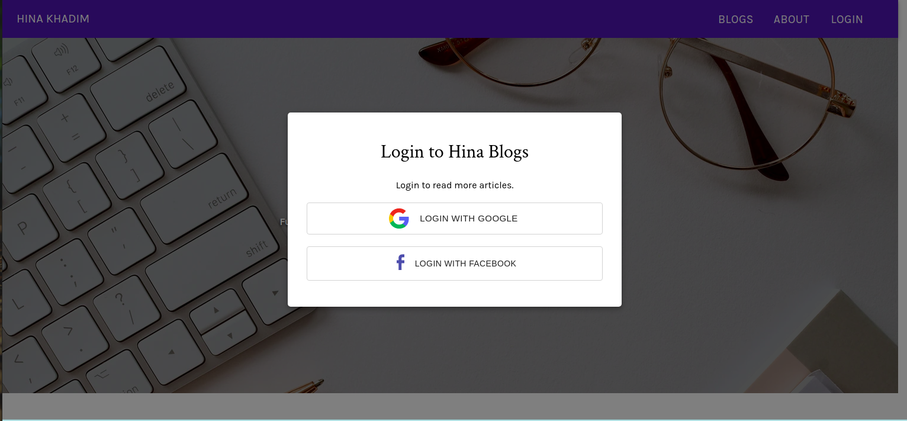
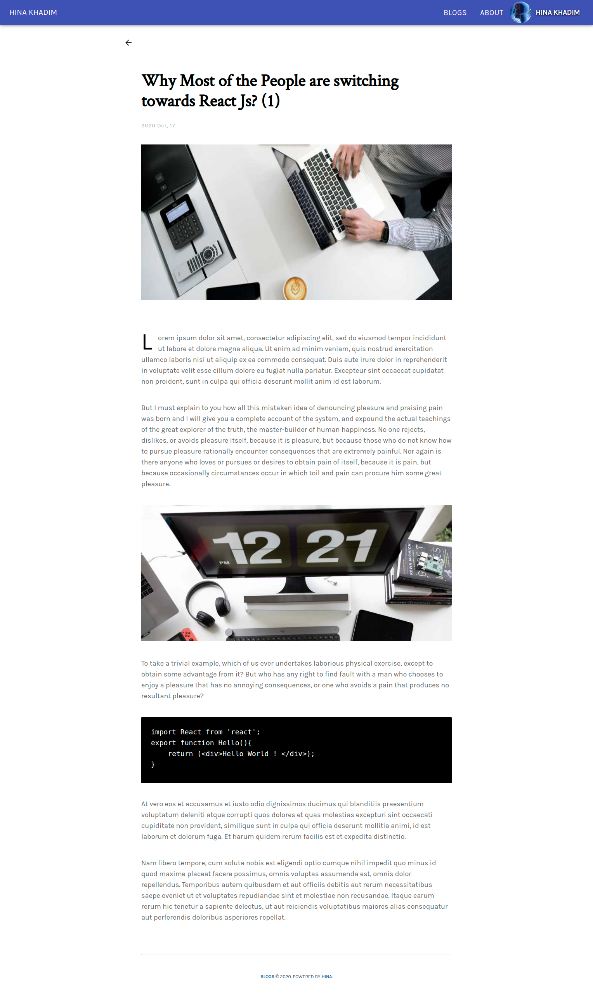

<p align="center">
  <a href="https://www.gatsbyjs.com">
    
  </a>
</p>


<h1 align="center">
  My Blog in GatsbyJs 🔥🔥
</h1>

[](https://app.netlify.com/sites/hina-blogs-2002/deploys)

##### ⭐️ Live Demo : http://hina-blogs-2002.netlify.app/

#### ⭐️ What tech I used:

⚡️ [Gatsby Js Minimal Starter](https://github.com/gatsbyjs/gatsby-starter-minimal)
⚡️ [Contentful (Headless CMS)](https://www.contentful.com/)
⚡️ [Material UI](https://material-ui.com)
⚡️ Firebase Authentication
⚡️ React Context API for state management
⚡️ Graphql
⚡️ Hosted on Netlify

<br />

###### ⭐️ Tech:

<div style="display: flex; align-items: center;">


</div>

<br />

##### ⭐️ Preview :







## 🚀 Quick start

1.  **Create a Gatsby site.**

    Use the Gatsby CLI to create a new site, specifying the minimal starter.

    ```shell
    # create a new Gatsby site using the minimal starter
    gatsby new my-site https://github.com/gatsbyjs/gatsby-starter-minimal
    ```

2.  **Start developing.**

    Navigate into your new site’s directory and start it up.

    ```shell
    cd my-site/
    gatsby develop
    ```

3.  **Open the code and start customizing!**

    Your site is now running at `http://localhost:8000`!


> Any Feedback is appreciated.😃😃